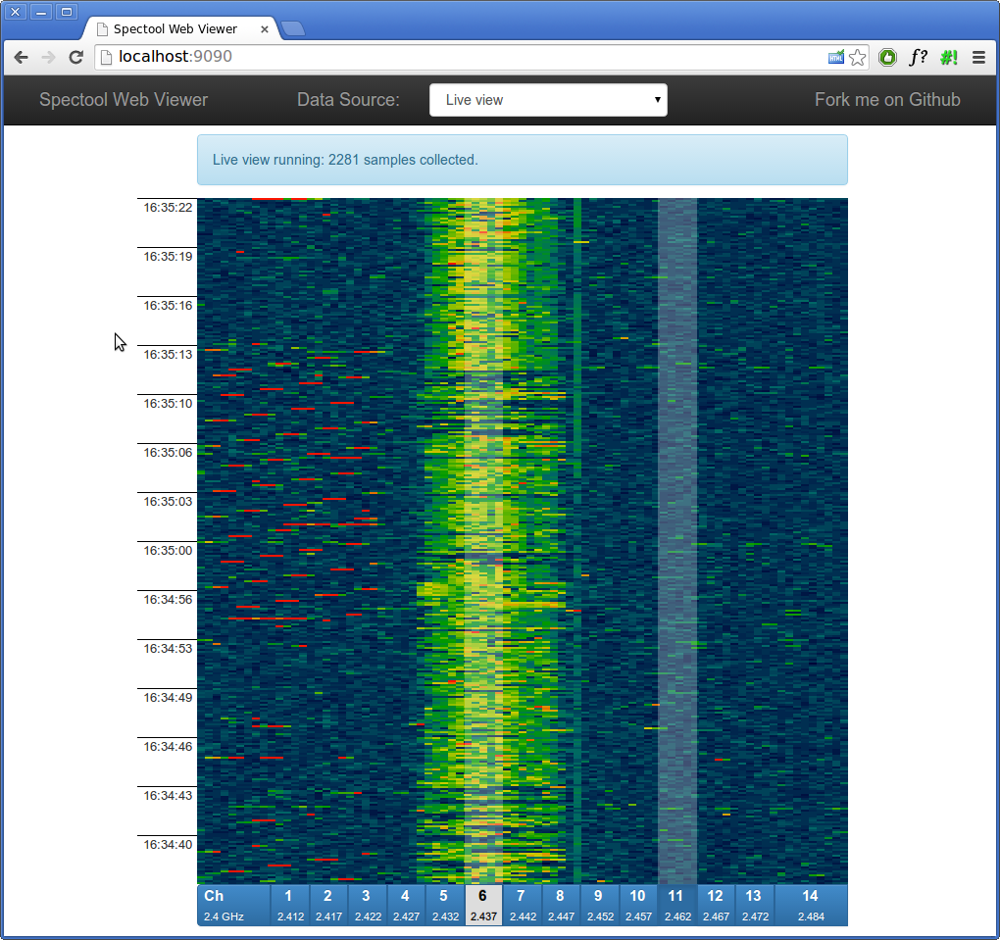

# A web viewer for RF spectrum data #

This project complements [Spectrum Tools](https://www.kismetwireless.net/spectools/) with a web viewer for spectrum data.

Both live and historical spectrum captures can be viewed. Data is captured by the [spectool_raw](http://manpages.ubuntu.com/manpages/hardy/man1/spectool_raw.1.html) program.

Typical uses:

* Wireless site surveys.
* Monitoring wireless spectrum usage.
* Diagnosing wireless problems after the fact.

Spectool Web Viewer has a small footprint and is ideal for embedded or resource-constrained systems. With the live capture feature disabled it operates as a static site.

## Usage ##

Quick start:

    make
    make serve-static

This will let you view historical captures.

To import your historical `spectool_raw` log files, copy or symlink them into htdocs/data/, run make again, and refresh the page.

To see live captures as well, make sure you have all the requirements below, then run:

    make
    make serve-full

## Requirements ##

For viewing historical captures on a static page, you need:

* [GNU make](http://www.gnu.org/software/make/)
* [python](http://python.org/) or an HTTP static file server of your choice

For the live view, you additionally need:

* `spectool_raw(1)` from [Spectrum Tools](https://www.kismetwireless.net/spectools/)
* `tcpserver(1)` from [ucspi-tcp](http://cr.yp.to/ucspi-tcp.html)
* `tai64n(1)`, `svscan(1)` and `supervise(1)` from [daemontools](http://cr.yp.to/daemontools.html)
* `openssl(1)` from the [OpenSSL project](https://www.openssl.org/)

To capture spectrum data, you'll also need spectrum analyzer hardware such as the [WiSPy](http://metageek.net/) or the [Ubertooth](http://ubertooth.sourceforge.net/).

## Author ##

Copyright (c) 2014
Alan Grow <alangrow+nospam@gmail.com>
