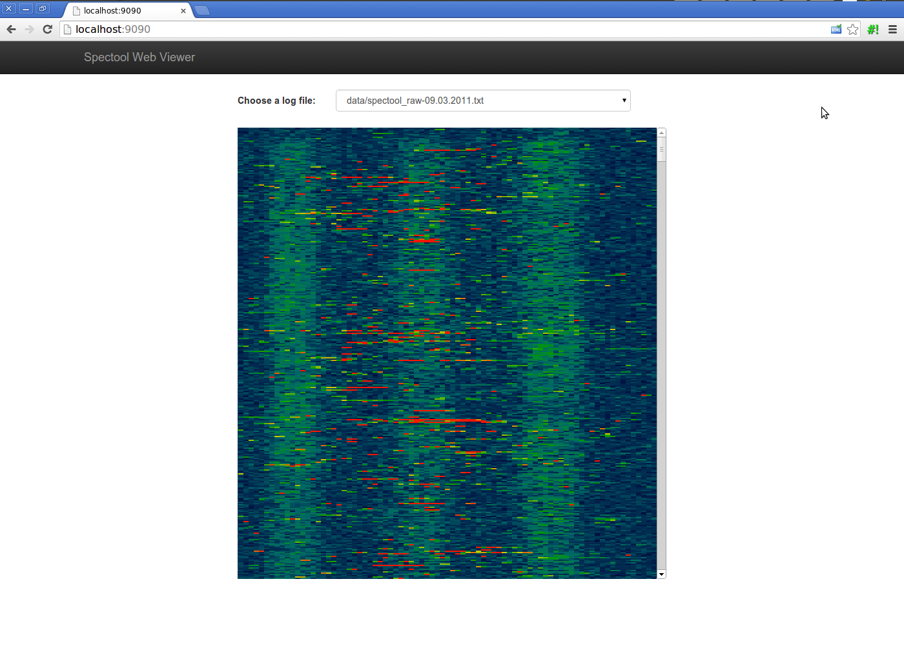

# A web viewer for spectrum analyzer data #

** Weekend afternoon project. Work in progress! **

This project complements [https://www.kismetwireless.net/spectools/](Spectrum Tools) with a web viewer for historical spectrum data captured by `spectool_raw`.

Typical uses:

* Wireless site surveys.
* Monitoring wireless spectrum usage.
* Diagnosing wireless problems.

## Screenshot ##

Pretty basic so far:

## Author ##

Copyright (c) 2014
Alan Grow <alangrow+nospam@gmail.com>
